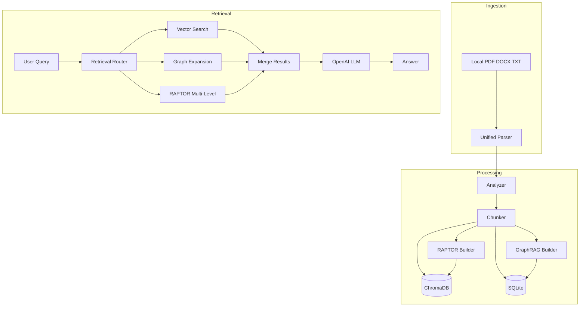

## Summary

I built an AI-powered document parser with intelligent chunking, GraphRAG, RAPTOR, and full Arabic/diacritics support. It implements all core requirements plus advanced RAG techniques for semantic retrieval and LLM integration.

## Contact Information

- **Email:** khouriferas74@gmail.com (required)
- **Phone:** 00962772462582 (optional)

## Demo Link

 [https://pyxon-ai-entry-task-feras-khouri.streamlit.app/](https://pyxon-ai-entry-task-feras-khouri.streamlit.app/) - **REQUIRED**

**Demo note:** Uses a shared OpenAI API key so reviewers can test "Generate Answer" without sign-up. The key will be revoked after 14 days.

## Features Implemented

- [X] Document parsing (PDF, DOCX, TXT)
- [X] Content analysis and chunking strategy selection
- [X] Fixed and dynamic chunking
- [X] Vector DB integration (ChromaDB)
- [X] SQL DB integration (SQLite)
- [X] Arabic language support
- [X] Arabic diacritics support (preserved in text)
- [X] Benchmark suite (6 benchmarks)
- [X] RAG integration ready

**Bonus features:**

- [X] GraphRAG (entity extraction, co-occurrence graph)
- [X] RAPTOR (hierarchical clustering retrieval)
- [X] 4 retrieval modes (vector, graph, raptor, hybrid)
- [X] OpenAI LLM integration
- [X] Arabic stopwords filtering (13k+ forms)
- [X] OCR support for scanned PDFs

## Architecture

### System Design



### Key Components

| Component  | Technology                       | Purpose                                           |
| ---------- | -------------------------------- | ------------------------------------------------- |
| Parsers    | PyMuPDF, python-docx             | Extract text from PDF/DOCX/TXT                    |
| Analyzer   | Heuristic analysis               | Auto-select fixed/dynamic chunking                |
| Chunker    | Custom (1024 chars, 128 overlap) | Split docs into semantic units                    |
| Vector DB  | ChromaDB                         | Semantic search via embeddings                    |
| SQL DB     | SQLite                           | Metadata, graph edges, relational queries         |
| GraphRAG   | spaCy + Arabic-Stopwords         | Entity graph for relationship queries             |
| RAPTOR     | scikit-learn K-means             | Hierarchical clustering for multi-level retrieval |
| Embeddings | sentence-transformers            | Multilingual (384-D vectors)                      |
| LLM        | OpenAI gpt-4o-mini               | Answer generation                                 |

## Technologies Used

- **Language:** Python 3.13
- **Parsing:** PyMuPDF (fitz), python-docx, pytesseract
- **NLP:** sentence-transformers, spaCy, Arabic-Stopwords
- **Storage:** ChromaDB, SQLite + SQLAlchemy
- **ML:** scikit-learn, numpy
- **Demo:** Streamlit
- **LLM:** OpenAI API

## Benchmark Results

Tested on 1500-word Arabic document with harakat:

```
=== Retrieval Benchmark ===
  chunk_count: 15
  queries_tested: 8
  precision_at_k: 0.75
  recall_at_k: 0.75
  mrr: 0.378

=== Chunking Benchmark ===
  chunk_count: 15
  avg_chunk_length: 927 chars
  std_dev_length: 163 chars

=== Performance Benchmark ===
  total_time_seconds: 10.4s
  peak_memory_mb: 76 MB

=== GraphRAG Benchmark ===
  graph_edges: 152
  edges_per_chunk: 10.1

=== RAPTOR Benchmark ===
  raptor_works: True
  multi_level_retrieval: Functional

=== Arabic Benchmark ===
  diacritics_in_source: 27
  diacritics_in_retrieved: 18
  encoding_ok: True
  retrieval_works: True
```

**Interpretation:**

- Precision 0.75: Good retrieval accuracy for keyword queries
- MRR 0.378: Relevant chunks typically in top 3-5
- GraphRAG 152 edges: Healthy entity graph density
- Arabic diacritics: Preserved correctly

## How to Run

### Local Setup

```bash
# Clone
git clone https://github.com/feraskhouri/pyxon-ai-entry-task.git
cd pyxon-ai-entry-task

# Install
pip install -r requirements.txt
python -m spacy download en_core_web_sm

# Run demo
streamlit run demo/app.py

# Run benchmarks
python benchmarks/run_all.py test3.docx
```

### Demo Usage

1. **Upload**: PDF, DOCX, or TXT files
2. **Search**: Select retrieval mode (vector/graph/raptor/hybrid), enter query
3. **Generate Answer**: Uses shared API key (no sign-up needed), ask questions
4. **Documents**: View all processed documents

### Programmatic Usage

```python
from src.document_processor import DocumentProcessor
from src.rag_client import RAGClient
from src.storage import VectorDB, SQLDB

# Initialize
processor = DocumentProcessor()
rag = RAGClient(processor.vector_db, processor.sql_db)

# Process
processor.process("document.pdf")

# Retrieve
results = rag.retrieve("query", mode="hybrid", top_k=5)

# Generate answer (with OpenAI)
answer = rag.answer("question?", use_llm=True, api_key="sk-...")
```

## Architecture Decisions & Trade-offs

### 1. Chunking Strategy

**Decision:** Heuristic-based (headings, length, variance) vs LLM-based

**Rationale:**

- Fast, no API costs
- Deterministic and explainable
- Works offline

**Trade-off:** Less accurate than LLM analysis but much faster

### 2. GraphRAG: No-LLM Entity Extraction

**Decision:** spaCy (English) + regex + frequency (Arabic) vs LLM-based NER

**Rationale:**

- No API costs
- Faster for batch processing
- Good enough for co-occurrence graphs

**Trade-off:** Misses some entities LLM would catch, but 10x faster

### 3. RAPTOR: Clustering vs Summarization

**Decision:** K-means on embeddings vs LLM-generated summaries

**Rationale:**

- Original RAPTOR uses LLM to summarize clusters
- My implementation uses cluster centroids (nearest chunk = "summary")
- No API costs, deterministic

**Trade-off:** Less coherent "summaries" but much cheaper and faster

### 4. ChromaDB (in-memory) vs Production Vector DB

**Decision:** ChromaDB with optional persistence vs Pinecone/Weaviate

**Rationale:**

- Zero setup, no external services
- Good for demo and development
- Persistent mode available

**Trade-off:** Not cloud-scale, but perfect for entry task

### 5. Keyword-based Benchmark

**Decision:** Keyword extraction from chunks vs hand-crafted queries

**Rationale:**

- Document-agnostic (works on any file)
- No manual query creation needed
- Tests retrieval mechanics

**Trade-off:** Not as realistic as real user queries, but reproducible and scalable

## Questions & Assumptions

### Question 1: DOC vs DOCX support

**Assumption:** Modern DOCX format only. Legacy .doc (binary format) not supported.

**Rationale:** DOCX is the standard since 2007; .doc requires `pywin32` or external conversion tools.

### Question 2: Web crawling scope

**Assumption:** Initially implemented with Crawl4AI but removed due to Python 3.13 + Windows compatibility issues.

**Rationale:** Core requirement is document parsing (PDF/DOCX/TXT). Web crawling was a bonus enhancement that proved incompatible with the development environment.

### Question 3: Benchmark overfitting

**Assumption:** Self-retrieval benchmark (query from chunk keywords) accepted as reasonable for demonstrating retrieval mechanics.

**Rationale:** Creating realistic ground-truth query-answer pairs requires domain expertise or LLM generation. Keyword-based approach is reproducible and document-agnostic.

### Question 4: Arabic entity normalization

**Assumption:** OK to strip diacritics for entity deduplication while preserving them in text.

**Rationale:** Same word with different harakat (كَتَبَ vs كُتُب) should be one entity for GraphRAG, but original text must preserve diacritics as required.

## Limitations

- **File size:** Large files (>100MB) loaded into memory; may cause OOM
- **OCR:** Requires Tesseract installed; falls back gracefully if missing
- **GraphRAG:** Entity extraction is frequency-based (≥2 occurrences); rare entities filtered
- **RAPTOR:** Uses clustering, not LLM summarization (cost/speed trade-off)
- **Benchmark:** Self-retrieval may not reflect real user query performance

## Future Improvements

1. **Streaming for large files:** Process PDFs/TXT in chunks to reduce memory
2. **LLM-based entity extraction:** Use GPT for more accurate NER
3. **RAPTOR with LLM summaries:** Generate proper summaries instead of centroid selection
4. **Hybrid chunking:** Combine fixed + dynamic with overlap
5. **Production DB:** Migrate to Pinecone/Weaviate + Postgres for scale
6. **Real-time updates:** Watch folders for new documents
7. **Multi-modal:** Support images, tables, charts
8. **Query expansion:** Use LLM to expand/rephrase queries
9. **Reranking:** Add cross-encoder reranking after initial retrieval
10. **Web crawling:** Resolve Python 3.13 compatibility or deploy on Linux
