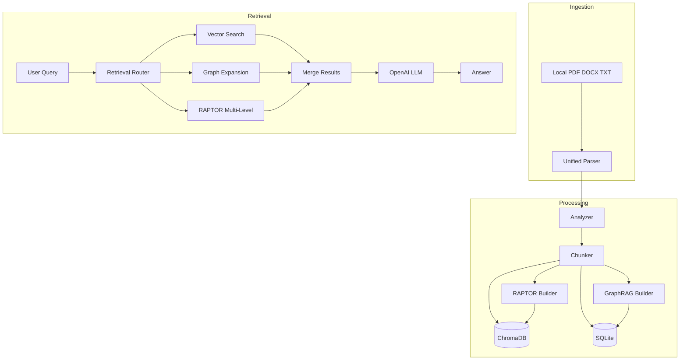

# Pyxon AI - Document Parser Implementation

AI-powered document parser with GraphRAG, RAPTOR, intelligent chunking, Vector + SQL storage, and full Arabic/diacritics support for RAG systems.

**Live demo:** [https://pyxon-ai-entry-task-feras-khouri.streamlit.app/](https://pyxon-ai-entry-task-feras-khouri.streamlit.app/) — Demo API key revoked after 14 days.

## Requirements

- **Python:** 3.10+ (tested on 3.13)
- **System:** Tesseract OCR (optional, for scanned PDFs)
  - Windows: Download from [tesseract-ocr](https://github.com/UB-Mannheim/tesseract/wiki)
  - Mac: `brew install tesseract`
  - Linux: `apt-get install tesseract-ocr`

## Quick Start

```bash
# Install dependencies
pip install -r requirements.txt

# Optional: spaCy English model (for GraphRAG entity extraction)
python -m spacy download en_core_web_sm

# Run the demo
streamlit run demo/app.py

# Run benchmarks
python benchmarks/run_all.py
```

## Project Structure

```
├── src/
│   ├── parsers/          # PDF, DOCX, TXT parsers
│   ├── analyzer.py       # Chunking strategy selection
│   ├── chunker.py        # Fixed & dynamic chunking
│   ├── graphrag/         # Entity extraction, co-occurrence graph
│   ├── raptor/           # Hierarchical clustering tree
│   ├── retrieval/        # Vector, graph, RAPTOR, hybrid retrieval
│   ├── llm/              # OpenAI answer generation
│   ├── storage/          # ChromaDB + SQLite
│   ├── document_processor.py
│   └── rag_client.py     # RAG interface
├── benchmarks/           # Retrieval, chunking, Arabic, performance, GraphRAG, RAPTOR
├── demo/                 # Streamlit app
├── sample_docs/          # Test files (including Arabic with harakat)
└── requirements.txt
```

## Architecture



## Features

- **Document parsing**: PDF (PyMuPDF + OCR), DOCX (python-docx), TXT
- **Intelligent chunking**: Fixed or dynamic based on document structure (1024 chars, 128 overlap)
- **GraphRAG**: Entity extraction (spaCy), co-occurrence graph, entity expansion retrieval
- **RAPTOR**: Hierarchical clustering tree for multi-level retrieval
- **Retrieval modes**: vector, graph, raptor, hybrid (auto-routed by query)
- **Storage**: ChromaDB (vectors) + SQLite (metadata, graph edges)
- **Arabic support**: Full UTF-8, diacritics preserved
- **LLM**: Optional OpenAI integration for answer generation

## How to Run

### Demo

```bash
streamlit run demo/app.py
```

- **Upload**: PDF, DOCX, TXT
- **Search**: Vector, Graph, RAPTOR, or Hybrid retrieval
- **Generate Answer**: OpenAI (demo uses a shared API key; no sign-up required)

### Benchmarks

```bash
python benchmarks/run_all.py
```

Individual benchmarks: `retrieval_benchmark.py`, `chunking_benchmark.py`, `arabic_benchmark.py`, `performance_benchmark.py`, `graphrag_benchmark.py`, `raptor_benchmark.py`

### Programmatic Usage

```python
from src.document_processor import DocumentProcessor
from src.rag_client import RAGClient
from src.storage import VectorDB, SQLDB

vector_db = VectorDB()
sql_db = SQLDB()
processor = DocumentProcessor(vector_db=vector_db, sql_db=sql_db)

# Process document
result = processor.process("document.pdf")

rag = RAGClient(vector_db, sql_db)
results = rag.retrieve("your query", mode="hybrid", top_k=5)
answer = rag.answer("question?", use_llm=True, api_key="sk-...", mode="graph")
```

## Retrieval Modes

| Mode | Use case |
|------|----------|
| vector | Standard semantic search |
| graph | Relationship queries (entities, connections) |
| raptor | Overview, summarization, main points |
| hybrid | Vector + graph fusion |

## Technologies

| Component | Technology |
|-----------|------------|
| PDF | PyMuPDF + pytesseract (OCR) |
| DOCX | python-docx |
| Entities | spaCy + Arabic-Stopwords |
| Embeddings | sentence-transformers (paraphrase-multilingual-MiniLM-L12-v2) |
| Clustering | scikit-learn |
| Vector DB | ChromaDB |
| SQL DB | SQLite + SQLAlchemy |
| LLM | OpenAI (optional) |
| Demo | Streamlit |

## Arabic Support

- UTF-8 encoding throughout
- Diacritics (harakat) preserved in text and chunks
- Diacritics normalized for entity extraction (reduces GraphRAG noise)
- 13,000+ Arabic stopwords filtered
- Multilingual embeddings support Arabic
- Sample: `sample_docs/arabic_with_harakat.txt`

## Limitations & Assumptions

- **File formats**: DOCX supported; legacy DOC not supported
- **OCR**: Requires Tesseract installation for scanned PDFs
- **Large files**: Files loaded into memory; very large documents (>100MB) may cause OOM
- **Benchmark**: Uses keyword-based self-retrieval; real user queries may perform differently
- **GraphRAG entities**: Frequency-based (≥2 occurrences); rare entities filtered out

## Future Work

- **OCR for PDF:** Improve or fix OCR handling for scanned PDFs (e.g. layout detection, language selection, quality tuning) so image-based PDFs are parsed reliably.
- **Conversation memory:** Give the LLM access to previous queries and answers so it can connect follow-up questions to earlier context (multi-turn Q&A, e.g. “What about the second one?” referring to a prior answer).

## Deployment (Streamlit Cloud)

To run your own instance:

1. Push this repo to GitHub
2. Go to [share.streamlit.io](https://share.streamlit.io) → **New app**
3. Select your repo, set main file to `demo/app.py`
4. In **Settings → Secrets**, add: `OPENAI_API_KEY = "sk-..."`
5. Deploy

**Live demo** (above): Uses a shared key for reviewer testing; key is revoked after 14 days.
